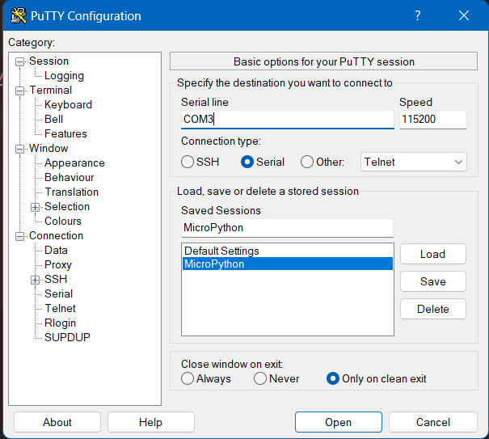

# Latebird Client

## Intro

> Welcome to DnA's geekiest quiz! 

In order to participate in the quiz, you first have to build your answering console from scratch.

In front of you are:
- Wemos D1 Mini WiFi microcontroller
- Cable
- Breadboard
- Connectors
- 4 Buttons
- 2 LEDs
- Buzzer

## Instructions

### 1. Download the repository to your PC

If you have Git installed, do:
```cmd
git clone https://github.com/JulesOO/Latebird-client.git
```

Otherwise, just download the repository as a ZIP file by clicking `<> Code` and `Download ZIP`:


### 2. Install python

Get it from [GHD software](https://mckinsey.service-now.com/ghd?id=mck_app_cat_item&sys_id=f13b9e1fdb55bf00c6722dcb0b96193b&class=pc_software_cat_item&utm_source=ghd_website&utm_medium=web&utm_content=search_results)

### 3. Install esptool

Open command prompt in your `Latebird-client` folder by navigating to the folder in file explorer and typing `cmd` in the address bar


In the command prompt, type:

```cmd
py -m pip install esptool
```

### 4. Install CH340 drivers

Go to the `CH340-drivers` folder and run `SETUP.EXE`. Then install.

### 5. Plug in board and find serial port

Press Windows key, type `device manager` and look for `Ports (COM & LPT)`.
Open the drop-down menu and check which port the board is connected to (`COM3`, `COM4`, ...)


### 6. Flash firmware onto board

Plug in board, go to command prompt and type:
```cmd
py flashfirmware.py
```

The program will ask which serial port the board is connected to. Type in the correct port.

### 7. Install putty

Get it from [GHD software](https://mckinsey.service-now.com/ghd?id=mck_app_cat_item&sys_id=5d6f99dddbf80f80b332f3561d961947&class=pc_software_cat_item&utm_source=ghd_website&utm_medium=web&utm_content=search_results)

### 8. Connect to board

Open Putty and configure the connecton:

- Set connection type to `serial`
- Type in the correct serial line 
- Set speed to 115200

Under saved sessions, type `MicroPython` and then press `Save` to save the configuration for future connections.



Once connected, press enter and type `help()` to see if the board is working properly.


**If you are the first to finish this step, raise your hand to get a bonus point!**

### 9. Connect the board to WiFi

Copy the commands shown in the output of the `help()` command, replacing:
- `<AP_name>` with the WiFi name
- `<key>` with the WiFi password


If done correctly, the output of the final command should be `True`

### 10. Launch WebREPL on board

First type `import webrepl_setup`, then `E` and then choose a password.


After rebooting, the board will display two IP addresses.


- The first ip is on the network hosted by the board
- The second ip is on the WiFi network, use this one

### 11.  Open WebREPL and connect to board

Make sure your PC is connected to the same network as the one on the board.
Then, open [WebREPL](./webrepl-master/webrepl.html) and type in the ip address you got in the previous step. 
Note: you have to prefix the IP with `ws://` and not `http://`

Press connect and input your password.


### 12. Upload boot.py & reset board

Upload `boot.py` to automate the steps you just completed (connecting to WiFi and launching WebREPL). After uploading the file, press the `Reset` button on your board.


Note: The chip needs a couple of seconds to reboot and connect to WiFi. To indicate the wait, the chip's LED will light up until the connection is established. Once the LED powers off, the WebREPL server is launched and you can reconnect on WebREPL.

### 13. Exercise 1: Test on-board LED

Upload `main.py` located in the `ex1-board-led` folder. Then reset the board.
After some time, the board's LED should start blinking.

**If you are the first to finish this step, raise your hand to get a bonus point!**

### 14. Exercise 2: Test external LED

Use the breadboard and cables to connect a `Green` and `Red` LED to your board.
Here's the schematic of the board. Connect the `Green` LED to `D8` and the `Red` LED to `D7`. Then connect both LEDs to ground.


Once everything is connected, upload `main.py` located in the `ex2-ext-led` folder. Then reset the board. 
Once you reconnect to WebREPL, you should see a prompt to ask which LED you want to blink.


**If you are the first to finish this step, raise your hand to get a bonus point!**

### 15.  Exercise 3: Test external buzzer

Use the breadboard and cables to connect the buzzer to your board.
Here's the schematic of the board. Connect the buzzer to Pin `D4` and to ground.


Once everything is connected, upload `main.py` located in the `ex3-buzzer` folder. Then reset the board. Now you should hear the start of `Frère Jacques`.

**If you are the first to finish this step, raise your hand to get a bonus point!**

### 16.  Exercise 4: Test buttons

Use the breadboard and cables to connect 4 buttons to your board. The buttons represent the multiple choice answers for the quiz. The buttons are mapped to the following pins:
```
A => D5
B => D1
C => D6
D => D2
```

Here's the schematic of the board. Connect each button to its corresponding pin and to ground.


Once everything is connected, upload `main.py` located in the `ex4-button` folder. Then reset the board. 
Once you reconnect to WebREPL, you can press each button and verify if they are working.

**If you are the first to finish this step, raise your hand to get a bonus point!**

### 17. Exercise 5: Register for the quiz

Now upload `main.py` located in the `ex5-quiz-basic` folder and restart the chip. Follow the instructions on the webREPL to register for the quiz. The script will ask for a team name and give you your ID. **Write that ID down to log back in later!**

**If you are the first to finish this step, raise your hand to get a bonus point!**

### 18. Exercise 6: Pimp your answering station with LEDs

Write code to make the `Green` and `Red` LEDs light up based on your quiz answer. 
When you answer the question correctly, the quiz sends you `Correct`. Light up the `Green` LED in this case.
For all other cases, turn the LED `Red`:
- Answer is wrong
- Answer was too late
- You have already answered the question

For this exercise, the solution code is not provided. You can re-use the code from exercise 2 to control the LEDs. 
Use the `/random` endpoint on the quiz server to receive a random output for testing while the quiz is not running.

Edit the `main.py` file located in the `ex6-quiz-led` folder to implement this logic. You should only have to change the part where `### Your code here ###` is written.

**If you are the first to finish this step, raise your hand to get a bonus point!**

### 19. Exercise 7: Get creative!

Let your imagination run wild and build whatever you want!
You can come up to the front if you need extra components.
Please write your code in `main.py` located in the `ex7-extra` folder.

**Before the quiz starts, the organisers will select the coolest final circuit. This team gets three bonus points!**

### 20. Prepare for the quiz!

Upload your last working script for the quiz answering station. 
We will run three test questions to assess whether your station is working. Note that these questions will count towards your final score!
