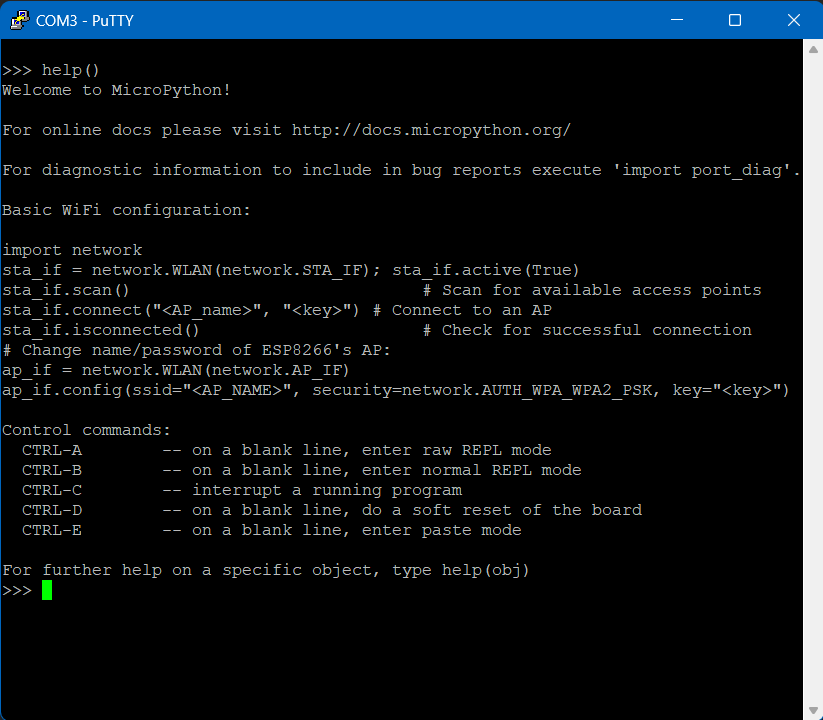
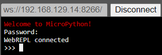
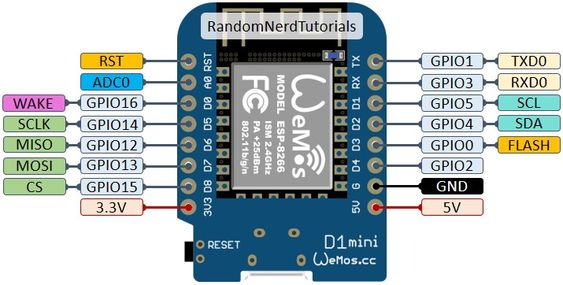

# Latebird Client

## Intro

> Welcome to DnA's geekiest quiz! 

In order to participate in the quiz, you first have to build your answering console from scratch.

In front of you are:
- Wemos D1 Mini WiFi microcontroller
- Cable
- Breadboard
- Connectors
- 4 Buttons

## Instructions

1. Download the repository to your PC

If you have Git installed, do:
```cmd
git clone https://github.com/JulesOO/Latebird-client.git
```

Otherwise, just download the repository as a ZIP file by clicking `<> Code` and `Download ZIP`:


2. Install python

Get it from [GHD software](https://mckinsey.service-now.com/ghd?id=mck_app_cat_item&sys_id=f13b9e1fdb55bf00c6722dcb0b96193b&class=pc_software_cat_item&utm_source=ghd_website&utm_medium=web&utm_content=search_results)

3. Install esptool

Open command prompt in your `Latebird-client` folder by navigating to the folder in file explorer and typing `cmd` in the address bar


In the command prompt, type:

```cmd
py -m pip install esptool
```

4. Install CH340 drivers

Go to the `CH340-drivers` folder and run `SETUP.EXE`. Then install.

5. Plug in board and find serial port

Press Windows key, type `device manager` and look for `Ports (COM & LPT)`.
Open the drop-down menu and check which port the board is connected to (`COM3`, `COM4`, ...)


6. Flash firmware onto board

Plug in board, go to command prompt and type:
```cmd
py flashfirmware.py
```

The program will ask which serial port the board is connected to. Type in the correct port.

7. Install putty

Get it from [GHD software](https://mckinsey.service-now.com/ghd?id=mck_app_cat_item&sys_id=5d6f99dddbf80f80b332f3561d961947&class=pc_software_cat_item&utm_source=ghd_website&utm_medium=web&utm_content=search_results)

8. Connect to board

Open Putty and configure the connecton:

- Set connection type to `serial`
- Type in the correct serial line 
- Set speed to 115200

Under saved sessions, type `MicroPython` and then press `Save` to save the configuration for future connections.


Once connected, press enter and type `help()` to see if the board is working properly.



**If you are the first to finish this step, raise your hand to get a bonus point!**

9. Connect the board to WiFi

Copy the commands shown in the output of the `help()` command, replacing:
- `<AP_name>` with the WiFi name
- `<key>` with the WiFi password


If done correctly, the output of the final command should be `True`

10. Launch WebREPL on board

First type `import webrepl_setup`, then `E` and then choose a password.


After rebooting, the board will display two IP addresses.


- The first ip is on the network hosted by the board
- The second ip is on the WiFi network, use this one

11.  Open WebREPL and connect to board

Make sure your PC is connected to the same network as the one on the board.
Then, open [WebREPL](./webrepl-master/webrepl.html) and type in the ip address you got in the previous step.
Press connect and input your password.



12. Upload boot.py & reset board

Upload `boot.py` to automate the steps you just completed (connecting to WiFi and launching WebREPL). After uploading the file, press the `Reset` button on your board.

Note that the reset waits for 10 seconds to ensure the WiFi connection is stable. You can check the progress on the PuTTy screen. Once the WebREPL server is launched, you can reconnect.

13.   Upload and run test-led file

Upload `main.py` located in the `test-led` folder. Then reset the board.
After some time, the board's LED should start blinking.

**If you are the first to finish this step, raise your hand to get a bonus point!**

14. Build answering console and run test-button file

Use the breadboard to connect 4 buttons to your board. The buttons are mapped to the following pins:
```
A => D5
B => D1
C => D6
D => D2
```

Here's a schematic of the board. Connect each button to its corresponding pin and to ground.


Once everything is connected, upload `main.py` located in the `test-button` folder. Then reset the board. Now you can press each button and verify if they are working.

**If you are the first to finish this step, raise your hand to get a bonus point!**

15.  Play quiz

Now upload `main.py` located in the root folder and restart the chip. Follow the instructions on your screen. The script will ask for a team name and give you your ID. **Write that ID down in case your chip needs to be reset!**

Good luck and have fun!